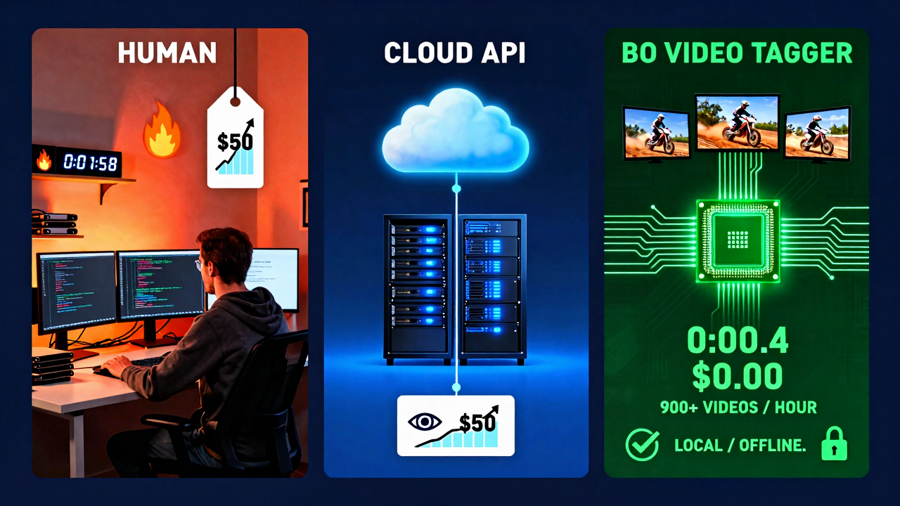

<p align="center">
  
</p>

# BO Video Tagger V2

**BO Video Tagger** is an automated, local-first video analysis tool. It uses the **SmolVLM2** Vision Language Model to "watch" your videos and generate searchable tags, detailed descriptions, and keywords.

---

## 🌟 Features
-   **Local Intelligence**: Runs 100% offline (Privacy First).
-   **Vision AI**: Uses `mmproj` projectors to understand video frames visually.
-   **Mapped Drive Support**: Works seamlessly with Google Drive, SMB Shares, and NAS (`Z:\` or `/Volumes/`).
-   **Adaptive Tiers**: Choose between **Fast (Smart)** or **High-Precision (Super)** analysis.
-   **Dynamic Output**: Auto-organizes results with timestamped filenames.

---

## Performance vs. Protocol
Manual tagging wastes human capital. Cloud APIs rent you back your own processing power while reading your data. **BO Video Tagger** runs on your metal, costs nothing, and outpaces the cloud.

| Metric | Human | Cloud API | BO Video Tagger 🚀 |
| :--- | :--- | :--- | :--- |
| **Throughput** | 2 mins / video | Variable (Latency dependent) | **~4 seconds / video** |
| **Burn Rate** | High (Time/Labor) | ~$50 per 1k videos | **$0.00** |
| **Security** | N/A | Server-side exposure | **Local / Offline** |
| **Volume** | 10 videos / hour | Rate Limited | **900+ videos / hour** |

<p align="center">
  
</p>

---

## 🛠️ Prerequisites
*   **OS**: macOS (Apple Silicon recommended) or Windows (with C++ Build Tools).
*   **Python**: 3.10+.
*   **RAM**: ~4GB minimum.

---

## 📦 Installation (Strict Guide)

To avoid dependency conflicts, **always use a Virtual Environment**.

### 🍎 macOS / Linux
Open Terminal and run:
```bash
# 1. Create Virtual Env
python3 -m venv venv

# 2. Activate it
source venv/bin/activate

# 3. Install Dependencies (with Apple Metal Acceleration)
CMAKE_ARGS="-DGGML_METAL=on" pip install llama-cpp-python --upgrade --force-reinstall --no-cache-dir
pip install -r requirements.txt
```

### 🪟 Windows
Open PowerShell/CMD and run:
```bash
# 1. Create Virtual Env
python -m venv venv

# 2. Activate it
.\venv\Scripts\activate

# 3. Install Dependencies
pip install -r requirements.txt
```

---

## 🚀 Usage

### 1. Basic Run (Local Folder)
```bash
# Ensure venv is active!
python bo_video_tagger.py "/Users/me/Movies/Vacation"
```

### 2. Network / Cloud Drives ☁️
You can process videos directly from Google Drive, Dropbox, or Mapped Network Shares.
*   **macOS**: Paths often look like `/Users/name/Library/CloudStorage/...` or `/Volumes/Public/...`
*   **Windows**: Paths look like `Z:\Videos` or `\\Server\Share`.

**Performance Note**: Processing over WiFi might be slower. The script extracts 5 frames per video.

```bash
# Example: Running on Google Drive
python bo_video_tagger.py "/Users/abhishekrai/Library/CloudStorage/GoogleDrive/My Drive/Videos"
```

### 3. Advanced Options
Control precision, speed, and output location.

| Flag | Description | Example |
| :--- | :--- | :--- |
| `--mode` | **smart** (Q8, Fast) or **super** (F16, Detailed) | `--mode super` |
| `--interval` | Seconds between frame checks (Default: 10s) | `--interval 5` |
| `--output` | Custom save folder or filename (**Must end in .jsonl**) | `--output ./results.jsonl` |
| `--debug` | Save analyzed frames to `debug_frames/` | `--debug` |
| `--unsafe` | **Skip integrity checks** (Use at own risk) | `--unsafe` |

**Full Power Run:**
```bash
python bo_video_tagger.py "/Volumes/NAS/Footage" --mode super --interval 5 --output ./nas_analysis.jsonl
```

---

## 🔒 Security & Integrity
This tool includes "brutal" security standards by default:
1.  **Integrity Verified**: Every model download is checked against a hardcoded SHA256 hash. If the file is corrupted or tampered with, the tool **will refuse to run**.
2.  **Safe Storage**: Models are stored in `~/.cache/bo_video_tagger/models` to keep your workspace clean.
3.  **Strict Output**: The tool strictly enforces `.jsonl` output buffers to prevent file system corruption.

### ⚠️ Unsafe Mode
If you are experimenting or using custom models, you can bypass these checks:
```bash
python bo_video_tagger.py /path/to/videos --unsafe
```
*Warning: This disables hash verification.*

---

## 📊 Output
Files are saved as **JSONL (JSON Lines)** for safety and speed.
Default name: `{Folder}_video_tags_{Date}.jsonl`

**New Rich Schema (V2.1):**
```json
{
  "meta": {
    "file": "clip_01.mp4",
    "path": "/abs/path/to/clip_01.mp4",
    "size_mb": 45.2,
    "duration_sec": 12.5,
    "resolution": "1920x1080",
    "fps": 30
  },
  "ai": {
    "summary": "A golden retriever playing tag in a park...",
    "description": "A golden retriever playing tag in a park. The dog is running...",
    "tags": ["dog", "park", "sunny", "slow-motion"]
  },
  "system": {
    "model": "SmolVLM2-500M-Video-Instruct-Q8_0.gguf",
    "timestamp": "2024-12-19 14:00:00",
    "processing_time_sec": 4.2
  }
}
```

---

## ❓ Troubleshooting

| Issue | Solution |
| :--- | :--- |
| **"Module not found..."** | Did you activate venv? Run `source venv/bin/activate`. |
| **Slow Processing** | If on Network Drive, try `--interval 20`. Or copy files locally. |
| **System Crash / OOM** | Use `--mode smart`. Close Chrome/Photoshop. |
| **Blank/Black Analysis** | Run with `--debug`. Check `debug_frames/` to see if video is readable. |
| **Integrity Failure** | Delete `~/.cache/bo_video_tagger` and re-run. Or use `--unsafe` (Risky). |
| **"Output must be .jsonl"** | Change your `--output` filename to end in `.jsonl`. |

---
*Powered by SmolVLM2 & Llama.cpp*
