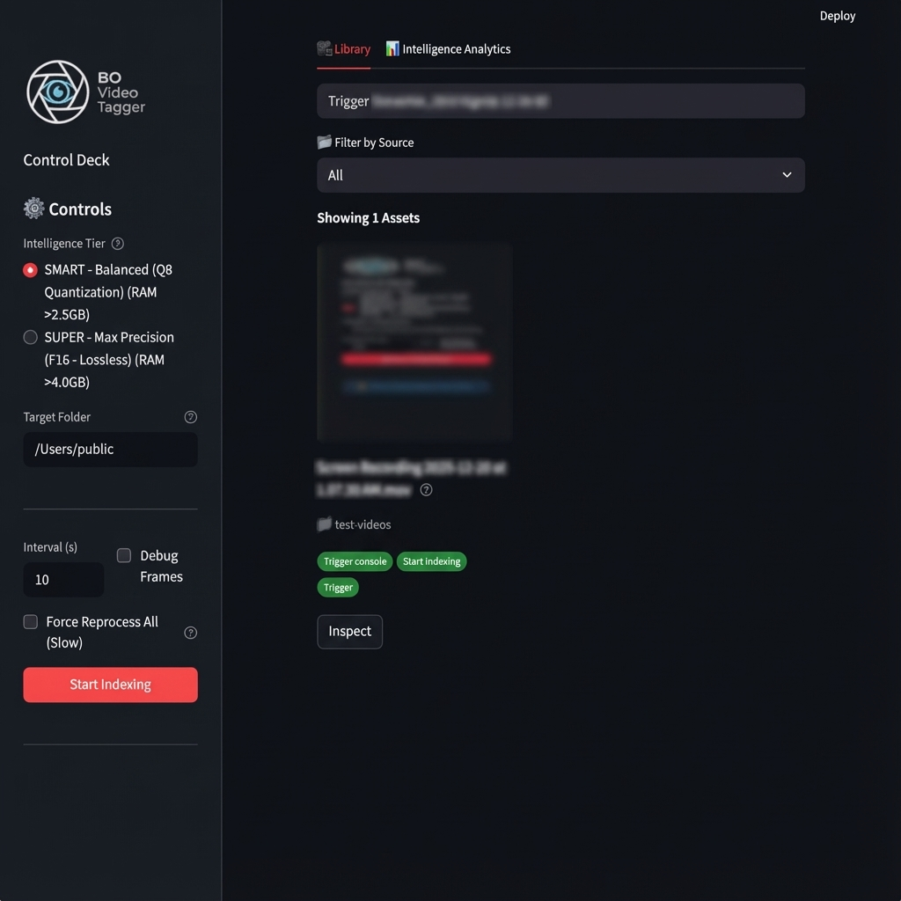
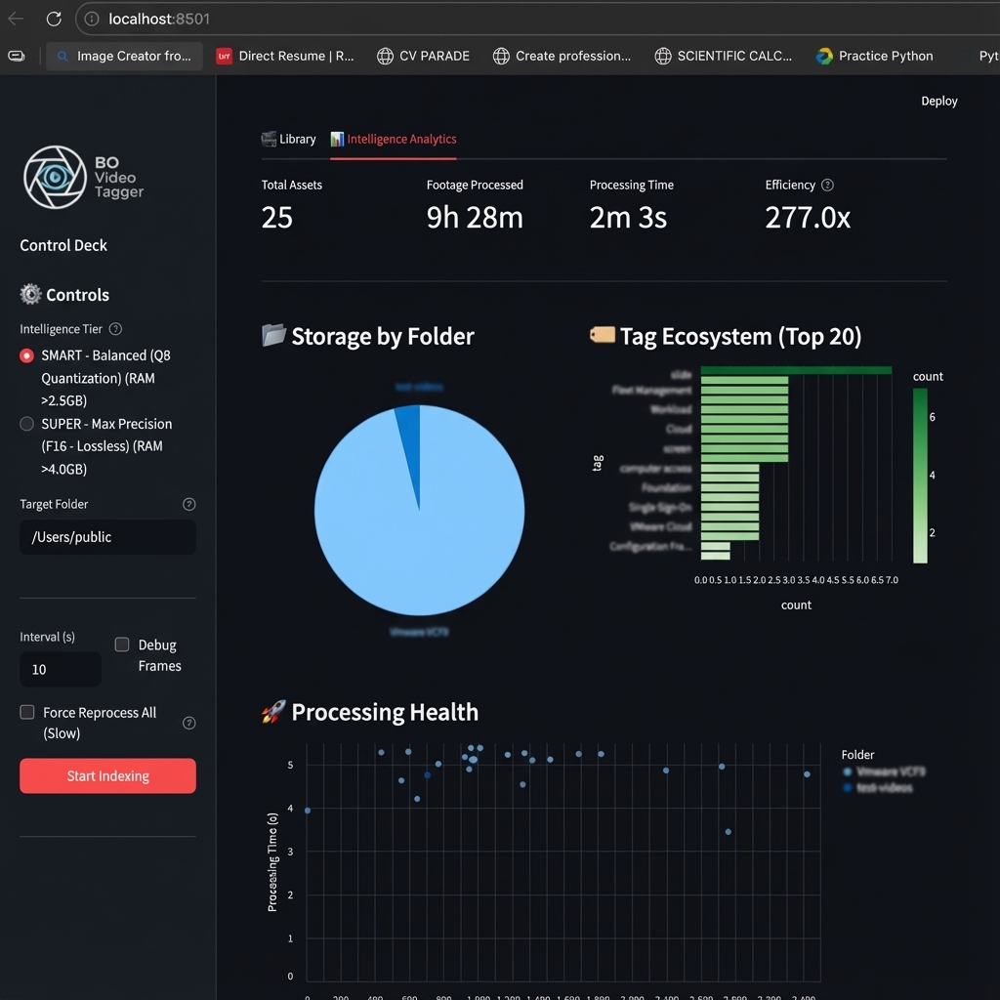

# 🎬 BO Video Tagger (v2.0)

**BO Video Tagger** is a local-first, AI-powered Video Asset Management (VAM) system. It uses **SmolVLM** (a Vision-Language Model) to watch your videos, generate detailed descriptions, extract tags, and organize your chaotic video library into a searchable, analytics-rich database.

## 🚀 Key Features

### 🧠 AI Intelligence
-   **Local VLM (Vision-Language Model)**: Uses `llama.cpp` and `SmolVLM2` to analyze video frames entirely offline. No data leaves your machine.
-   **Smart Tagging**: Automatically generates descriptive tags (e.g., "Drone Shot, Sunset, Forest") and summaries.
-   **Semantic Search**: Search for "a calm lake at dawn" and find relevant videos even if they aren't explicitly named that.

### ⚡ Performance & Scalability
-   **Smart Skip Logic**: The indexer checks the database in **O(1)** time. Re-running the indexer on a 10TB library takes seconds if no new files are added.
-   **Force Reprocess**: Need to re-analyze? A sidebar control allows you to force a fresh look at your assets.
-   **Optimized Database**: SQLite backend with FTS5 (Full Text Search) and `parent_folder` indexing for instant filtering.

### 📊 Analytics & Insights
-   **Tag Ecosystem**: Visualize which tags are most common in your library.
-   **Storage Analysis**: See which folders are consuming the most space.
-   **Efficiency Metrics**: Track processing speed (FPS) and database size.

## 🛠️ Installation

### Prerequisites
-   **Python 3.10+**
-   **FFmpeg** (Recommended for OpenCV to work smoothly)
-   **Mac (Apple Silicon)** or **NVIDIA GPU** recommended for AI acceleration.

### Setup
1.  **Clone the Repository**:
    ```bash
    git clone https://github.com/abhishekaryan23/BO-Video-Tagger.git
    cd BO-Video-Tagger
    ```

2.  **Create a Virtual Environment**:
    ```bash
    python3 -m venv venv
    source venv/bin/activate
    ```

3.  **Install Dependencies**:
    ```bash
    pip install -r requirements.txt
    ```

## 🏃‍♂️ Usage

1.  **Start the Application**:
    ```bash
    streamlit run app.py
    ```

2.  **Indexer Configuration (Sidebar)**:
    -   **Intelligence Tier**: Select `Smart` (Fast) or `Super` (High Accuracy).
    -   **Target Folder**: Enter the absolute path to your video folder.
    -   **Force Reprocess All**: Check this ONLY if you want to re-analyze everything (slow).
    -   **Start Indexing**: Click to begin. The first run will download AI models (~2-4GB).

3.  **Explore**:
    -   **Gallery**: Browse your videos, filter by folder, or search.
        
    -   **Inspect**: Click "Inspect" on any video to play it and edit tags manually.
    -   **Analytics**: Switch to the "Intelligence Analytics" tab for charts and graphs.
        

## 🔒 Security & Privacy
-   **100% Offline**: Models run locally via `llama-cpp-python`.
-   **Safe Mode**: Integrity checks (SHA256) are performed on all model downloads.
-   **No Telemetry**: The app does not track your usage.

## 📂 Project Structure
-   `app.py`: Main Streamlit application.
-   `bo_worker.py`: Background thread for AI processing.
-   `bo_video_tagger.py`: Core AI logic (SmolVLM + OpenCV).
-   `bo_db.py`: Database layer (SQLite + Vector Search).
-   `components/`: UI modules for Sidebar, Gallery, Analytics, etc.

---
*Built with ❤️ by the BO Video Tagger Team*
